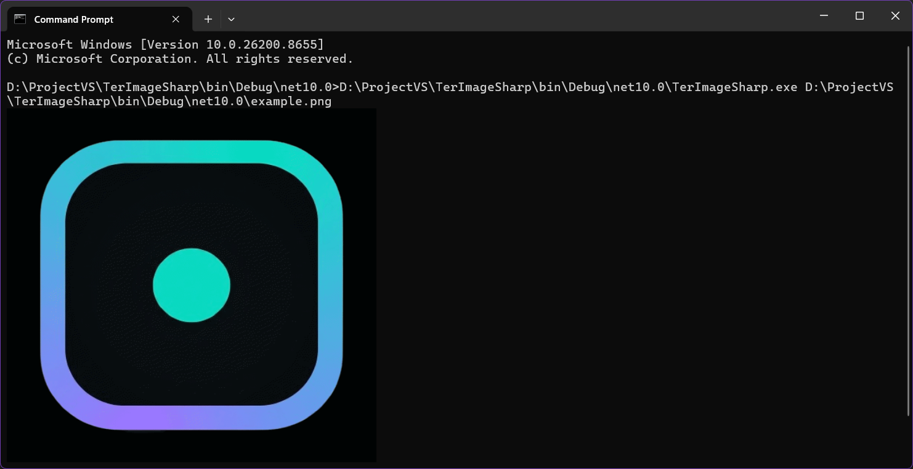

<div align="center">

# TerImageSharp

**Real pixel graphics for the terminal.** Sixel and Kitty protocol — no block characters, no braille, no character-art fallback. Ever.

[](https://dotnet.microsoft.com/)
[](LICENSE)
[](#)
[](https://sixlabors.com/products/imagesharp/)
[](CONTRIBUTING.md)

</div>

---

## What is this?

`TerImageSharp` decodes an image and writes **actual pixel data** straight into your terminal using real graphics protocols — [Sixel](https://en.wikipedia.org/wiki/Sixel) (DECSIXEL) and the [Kitty graphics protocol](https://sw.kovidgoyal.net/kitty/graphics-protocol/) — the same class of output tools like `chafa` produce when a Sixel/Kitty-capable terminal is detected. There is no glyph-art rendering path in this codebase at all: if your terminal can't do real graphics, `TerImageSharp` tells you so instead of quietly degrading to blocks or braille.

| | |
|---|---|
| 🎨 | Two real graphics backends: **Sixel** (palette-based, widest terminal support) and **Kitty protocol** (true 24-bit color, zero quantization loss) |
| 🧠 | Auto-detects your terminal and picks the best protocol — falls back to Sixel if it can't tell |
| 🎞️ | Full **animated GIF** playback — loop count, per-frame timing, `--fps` override |
| 🖼️ | PNG · JPEG · BMP · GIF · TGA · PBM |
| 🌈 | Median-cut quantization + Floyd–Steinberg dithering for clean Sixel gradients |
| 🪟 | Windows console VT-processing auto-enable baked in |

---

## Preview

```
$ TerImageSharp.exe ./photo.png
```



---

## Install / Build

```bash
git clone https://github.com/<your-username>/TerImageSharp.git
cd TerImageSharp
dotnet add package SixLabors.ImageSharp
dotnet build -c Release
```

Run it:

```bash
TerImageSharp.exe ./photo.png
```

> **Windows users:** run this inside **Windows Terminal** (`wt.exe`). Classic `cmd.exe` / conhost does not implement Sixel at all, no matter what the code does — Windows Terminal does.

---

## Usage

```
TerImageSharp.exe <image> [options]
```

### Protocol

| Flag | Description |
|---|---|
| `--auto` | Auto-detect terminal (default). Falls back to `--sixel` if unknown. |
| `--sixel` | Force Sixel output. |
| `--kitty` | Force Kitty graphics protocol output (truecolor, no quantization). |

### Sixel-only

| Flag | Description |
|---|---|
| `--colors N` | Palette size, 2–256 (default 256). |
| `--no-dither` | Disable Floyd–Steinberg dithering (nearest-color only). |
| `--bg R,G,B` \| `--bg #hex` | Background used to flatten transparency (default black). |

### Sizing

| Flag | Description |
|---|---|
| `--width N` | Resize to exact pixel width (aspect kept if height omitted). |
| `--height N` | Resize to exact pixel height (aspect kept if width omitted). |
| `--scale F` | Scale factor applied to native size, e.g. `0.5`. |

### Animated GIFs

| Flag | Description |
|---|---|
| `--loop N` | Override loop count (0 = infinite). |
| `--fps F` | Override playback speed, ignoring each frame's own delay. |
| `--once` | Play through once and stop, ignoring the GIF's own loop count. |

### Other

| Flag | Description |
|---|---|
| `--info` | Print format/dimensions/frame count and exit — no rendering. |
| `-h`, `--help` | Show help. |

### Examples

```bash
# Auto-detect, default settings
TerImageSharp.exe ./cat.png

# Force Kitty protocol, true color, no palette loss
TerImageSharp.exe ./cat.png --kitty

# Sixel with a smaller palette and no dithering
TerImageSharp.exe ./cat.png --sixel --colors 64 --no-dither

# Half-size render
TerImageSharp.exe ./cat.png --scale 0.5

# Animated GIF, play twice as fast, once through
TerImageSharp.exe ./party.gif --fps 24 --once

# Just inspect the file
TerImageSharp.exe ./party.gif --info
```

---

## How it works

```
image file
    │
    ▼
ImageSharp decode ──▶ (multi-frame? ──▶ animation loop, per-frame timing)
    │
    ▼
terminal capability detection ──▶ Kitty or Sixel
    │
    ├── Kitty ──▶ raw RGBA ──▶ base64 chunks ──▶ APC escape sequences (true color, real alpha)
    │
    └── Sixel ──▶ median-cut quantize ──▶ Floyd–Steinberg dither ──▶ 6-row band encoding + RLE ──▶ DECSIXEL
```

| File | Responsibility |
|---|---|
| `Program.cs` | Entry point, enables Windows VT processing |
| `CliOptions.cs` | Argument parsing |
| `TerminalCapabilities.cs` | Sixel vs Kitty auto-detection |
| `ImageRenderer.cs` | Orchestration: static render + GIF animation loop |
| `MedianCutQuantizer.cs` | Palette generation for Sixel |
| `FloydSteinbergDitherer.cs` | Error-diffusion dithering onto the palette |
| `SixelEncoder.cs` | Raw DECSIXEL escape-sequence encoder |
| `KittyEncoder.cs` | Raw RGBA → Kitty graphics protocol encoder |
| `WindowsConsoleSupport.cs` | Enables `ENABLE_VIRTUAL_TERMINAL_PROCESSING` on Windows |

---

## Terminal support

| Terminal | Protocol |
|---|---|
| Windows Terminal | Sixel |
| kitty | Kitty |
| WezTerm | Kitty |
| Ghostty | Kitty |
| Konsole | Kitty |
| foot | Sixel |
| mlterm | Sixel |
| xterm (built with `--enable-sixel-graphics`) | Sixel |
| mintty | Sixel |
| iTerm2 | Sixel |
| Command Prompt / conhost | ❌ Not supported |

---

## Known limitations

- Terminal capability detection is environment-variable based, not a live DA1 query — it can guess wrong on unusual terminal setups.
- Sixel has no alpha channel at the protocol level; transparency is flattened onto `--bg` before quantization. Kitty preserves real alpha.
- No auto-fit to terminal cell size yet — use `--width`/`--height`/`--scale` manually.

Issues and PRs welcome.

---

## License

MIT — see [LICENSE](LICENSE).
